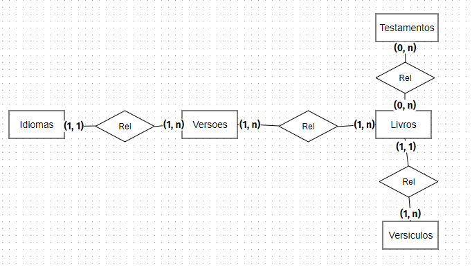

# Api Rest com Laravel 9 na prática

https://www.udemy.com/course/api-rest-com-laravel-9-na-pratica


## <a name="indice">Índice</a>

1. [Seção 1: Introdução](#parte1)     
2. [Seção 2: Mãos na massa](#parte2)     
3. [Seção 3: Migrations](#parte3)     
4. [Seção 4: Create, Read, Update e Delete. Criação de EndPoints Insomnia](#parte4)     
5. [Seção 5: Melhorias](#parte5)     
6. [Seção 6: Autenticação Sanctum](#parte6)     
7. [Seção 7: Relacionamentos](#parte7)     
8. [Seção 8: Desafios](#parte8)     
9. [Seção 9: Extras](#parte9)     
10. [Seção 10: ApiResource](#parte10)     
11. [Seção 11: HATEOAS](#parte11)     
12. [Seção 12: Links Úteis](#parte12)     
13. [Seção 13: Atualizações](#parte13)     
14. [Seção 14: Frontend](#parte14)     
---


## <a name="parte1">1 - Seção 1: Introdução</a>

- 1. Introdução e Estrutura de Pastas do sistema.

[https://candied-gooseberry-205.notion.site/Criando-API-REST-com-Laravel-9-606573f493e9494b9b7abc7ac1298828](https://candied-gooseberry-205.notion.site/Criando-API-REST-com-Laravel-9-606573f493e9494b9b7abc7ac1298828)

- 2. Conceitos importantes
- 3. API REST

[Voltar ao Índice](#indice)

---


## <a name="parte2">2 - Seção 2: Mãos na massa</a>

- 4. Ambiente de Desenvolvimento
- 5. Criação do Projeto

[Voltar ao Índice](#indice)

---


## <a name="parte3">3 - Seção 3: Migrations</a>

- 6. Criação das tabelas


```bash
 sail php artisan make:model Testamento --migration

   INFO  Model [app/Models/Testamento.php] created successfully.  
   INFO  Migration [database/migrations/2023_04_25_184754_create_testamentos_table.php] created successfully. 

sail php artisan make:model Livro --migration

   INFO  Model [app/Models/Livro.php] created successfully.  
   INFO  Migration [database/migrations/2023_04_25_185801_create_livros_table.php] created successfully.  

sail php artisan make:model Versiculo --migration

   INFO  Model [app/Models/Versiculo.php] created successfully.  
   INFO  Migration [database/migrations/2023_04_25_185835_create_versiculos_table.php] created successfully.  
```


[Voltar ao Índice](#indice)

---


## <a name="parte4">4 - Seção 4: Create, Read, Update e Delete. Criação de EndPoints Insomnia</a>

- 7. Testamentos

```bash

sail php artisan make:controller TestamentoController --api

   INFO  Controller [app/Http/Controllers/TestamentoController.php] created successfully.  

```

- 8. Livros
- 9. Versículos

[Voltar ao Índice](#indice)

---


## <a name="parte5">5 - Seção 5: Melhorias</a>

- 10. Rotas

```php
//Route::get( '/testamento', [TestamentoController::class, 'index']);
//Route::get( '/testamento/{id}', [TestamentoController::class, 'show']);
//Route::put( '/testamento/{id}', [TestamentoController::class, 'update']);
//Route::post('/testamento', [TestamentoController::class, 'store']);
//Route::delete('/testamento/{id}', [TestamentoController::class, 'destroy']);
//
//Route::get( '/livro', [LivroController::class, 'index']);
//Route::get( '/livro/{id}', [LivroController::class, 'show']);
//Route::put( '/livro/{id}', [LivroController::class, 'update']);
//Route::post('/livro', [LivroController::class, 'store']);
//Route::delete('/livro/{id}', [LivroController::class, 'destroy']);
//
//Route::get( '/versiculo', [VersiculoController::class, 'index']);
//Route::get( '/versiculo/{id}', [VersiculoController::class, 'show']);
//Route::put( '/versiculo/{id}', [VersiculoController::class, 'update']);
//Route::post('/versiculo', [VersiculoController::class, 'store']);
//Route::delete('/versiculo/{id}', [VersiculoController::class, 'destroy']);

/*
Route::apiResource('testamento',TestamentoController::class);
Route::apiResource('livro',LivroController::class);
Route::apiResource('versiculo',VersiculoController::class);
*/

Route::apiResources([
    'testamento'=> TestamentoController::class,
    'livro'=> LivroController::class,
    'versiculo'=> VersiculoController::class,
]);

```

- 11. Controllers

[Voltar ao Índice](#indice)

---


## <a name="parte6">6 - Seção 6: Autenticação Sanctum</a>

- 12. Introdução

- [https://laravel.com/docs/10.x/sanctum#main-content](https://laravel.com/docs/10.x/sanctum#main-content)

```bash
sail php artisan vendor:publish --provider="Laravel\Sanctum\SanctumServiceProvider"     

   INFO  Publishing assets.  

  Copying directory [vendor/laravel/sanctum/database/migrations] to [database/migrations] ..................................................... DONE
  File [config/sanctum.php] already exists ................................................................................................. SKIPPED 

sail php artisan migrate                                                                              

   INFO  Nothing to migrate.  

```

- 13. Registrando usuário e emitindo Token

```bash
sail php artisan make:controller AuthController           

   INFO  Controller [app/Http/Controllers/AuthController.php] created successfully.  

```

- 14. Login
- 15. Protegendo as rotas

```php
Route::group(['middleware' => ['auth:sanctum']], function () {
    Route::apiResources([
        'testamento' => TestamentoController::class,
        'livro' => LivroController::class,
        'versiculo' => VersiculoController::class,
    ]);

});


Route::post('/register', [AuthController::class, 'register']);
Route::post('/login', [AuthController::class, 'login']);

```

- 16. Logout

[Voltar ao Índice](#indice)

---


## <a name="parte7">7 - Seção 7: Relacionamentos</a>

- 17. Testamento com Livros
- 18. Livros com Versiculos

[Voltar ao Índice](#indice)

---


## <a name="parte8">8 - Seção 8: Desafios</a>

- 19. Desafio 1

```
Desafio 1

Objetivo criar 2 tabelas e relaciona-las com o restante.

Utilize Migrations

Tabela 1
Idiomas - Cadastro simples id, nome

Tabela 2
Traducoes - Id, nome, abreviacao, idioma_id (Chave Estrangeira)

Crie os Models necessários.

Crie os relacionamentos necessários.

Crie um Crud Completo de ambos.
```

- 20. Resposta do Desafio

[Voltar ao Índice](#indice)

---


## <a name="parte9">9 - Seção 9: Extras</a>

- 21. Upload de Imagem

Tornar a pasta pública

```
sail php artisan storage:link

   INFO  The [public/storage] link has been connected to [storage/app/public].  

```


[Voltar ao Índice](#indice)

---


## <a name="parte10">10 - Seção 10: ApiResource</a>

- 22. Introdução e Primeiros Exemplos

```bash
sail php artisan make:resource IdiomaResource                      

   INFO  Resource [app/Http/Resources/IdiomaResource.php] created successfully.  

```

```php
class IdiomaResource extends JsonResource
{
    /**
     * Transform the resource into an array.
     *
     * @return array<string, mixed>
     */
    public function toArray(Request $request): array
    {
        // return parent::toArray($request);
        return [
            'id' => $this->id,
            'nome' => $this->nome,

        ];
    }
}
```

```php
  public function show(string $id)
    {
        $idioma = Idioma::find($id);
        if ($idioma) {
            // $idioma->versoes;
            return new IdiomaResource($idioma);
        }
        return response()->json([
            'message' => 'Erro ao PESQUISAR o idioma',
        ], 404);
    }
```


```bash
 sail php artisan make:resource VersoesCollection --collection

   INFO  Resource collection [app/Http/Resources/VersoesCollection.php] created successfully.  

```

```php
class VersoesCollection extends ResourceCollection
{
    /**
     * The "data" wrapper that should be applied.
     *
     * @var string|null
     */
    public static $wrap = 'versoes';

    /**
     * Transform the resource collection into an array.
     *
     * @return array<int|string, mixed>
     */
    public function toArray(Request $request): array
    {
        return parent::toArray($request);
    }
}
```

```php
class AppServiceProvider extends ServiceProvider
{
    /**
     * Bootstrap any application services.
     */
    public function boot(): void
    {
        JsonResource::withoutWrapping();
    }
}
```

- 23. ApiResource - Continuação
- 24. ApiResource - Finalizando

[Voltar ao Índice](#indice)

---


## <a name="parte11">11 - Seção 11: HATEOAS</a>

- 25. O que é Hateoas?

HATEOAS é um modelo desenvolvido por Leonard Richardson que traz o modelo REST para um novo nível, e cujo objetivo é ajudar os clientes que consomem o serviço REST, ou seja, nossa Web API, a navegar pelos recursos e saber o que podem fazer tornado as ações da WEB API mais fáceis de entender.

Usando uma explicação o mais simples possível, imagine que você faz uma requisição a uma API, e ela vai retornar um objeto ou coleção de objetos como resposta. Essa seria a WEB API sem usar HATEOAS.

Usando HATEOAS a resposta da API acrescenta também links descritivos que servem para informar como você pode alterar o recurso e informações de como buscar recursos secundários ou relacionados.

Entendendo o HATEAOS na prática:

Vamos tomar um exemplo bem simples muito comum em nosso projeto.

Model Livro

A representação JSON desta classe para um retorno de uma requisição GET de um livro específico seria expresso da seguinte forma:

Corpo de um response REST para : http://localhost/api/livro/1

```json
{
    nome => 'Genêsis',
    posicao => 1,
    abreviacao => 'gn',
    testamento_id => 1,
    versao_id => 1
}
```

Se implementássemos o HATEOAS, os serviços que podem ser invocados com aquele recurso também seriam devolvidos pela API. Poderíamos ter uma resposta parecida com a ilustrada abaixo:

```json
{
    nome => 'Genêsis' ,
    posicao => 1,
    abreviacao => 'gn',
    testamento_id => 1,
    versao_id => 1
    links: [
        { rel: 'alterar', link: '/api/livro/1' },
        { rel: 'excluir, link: '/api/livro/1' },
    ]
}
```

Perceba que a própria API informa os serviços disponíveis para o recurso livro, quebrando este acoplamento: o cliente agora não precisa saber o que pode ser feito com aquele recurso, bastando a ele interagir com os hiperlinks que foram devolvidos pela API, hiperlinks estes que expõem as ações que podem ser realizadas.


- 26. HATEOAS na prática

```php
class IdiomaResource extends JsonResource
{
    public function toArray(Request $request): array
    {
        return [
            'id' => $this->id,
            'nome' => $this->nome,
            'versoes' => new VersoesCollection($this->whenLoaded('versoes')),
            'links' => [
                [
                    'rel' => 'Alterar um idioma',
                    'type' => 'PUT',
                    'link' => route('idioma.update', $this->id)
                ],
                [
                    'rel' => 'Excluir um idioma',
                    'type' => 'DELETE',
                    'link' => route('idioma.destroy', $this->id)
                ]
            ]
        ];
    }
}
```

[Voltar ao Índice](#indice)

---


## <a name="parte12">12 - Seção 12: Links Úteis</a>

- 27. Links Úteis

https://candied-gooseberry-205.notion.site/Criando-API-REST-com-Laravel-9-606573f493e9494b9b7abc7ac1298828

Modelo :



3. GitHub: https://github.com/marcelobianco/apibiblia

[Voltar ao Índice](#indice)

---


## <a name="parte13">13 - Seção 13: Atualizações</a>

- 28. Comunicado
- 29. Introdução, Clone Git e Instalação de pacotes
- 30. Seeders
- 31. Filtros

```php
class SiteController extends Controller
{
    public function ler_a_biblia($versao, $livro = null, $capitulo = null, $versiculo = null)
    {
        $versiculos = Versiculo::whereHas('livro', function ($query) use ($versao, $livro) {

            $query->whereHas('versao', function ($query) use ($versao) {
                $query->where('abreviacao', $versao);
            });

            $query->when('livro', function ($query) use ($livro) {
                $query->where('abreviacao', $livro);
            });

        })
            ->when($capitulo, function ($query) use ($capitulo){
                $query->where('capitulo', $capitulo);
            })
            ->when($versiculo, function ($query) use ($versiculo){
                $query->where('versiculo', $versiculo);
            })
            ->get();
        return response($versiculos, 200);
    }
}
```

- 32. Scope Filters

[Voltar ao Índice](#indice)

---


## <a name="parte14">14 - Seção 14: Frontend</a>

- 33. Instalando o VueJs
- 34. Instalando o Tailwind Css
- 35. Definindo Menu, Home e incluindo Router View
- 36. Finalizando o Home e Consumindo a API com AXIOS

[Voltar ao Índice](#indice)

---

